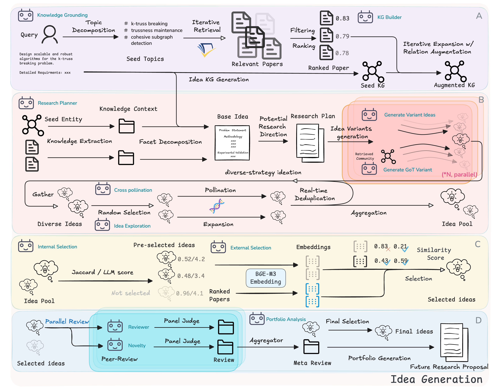
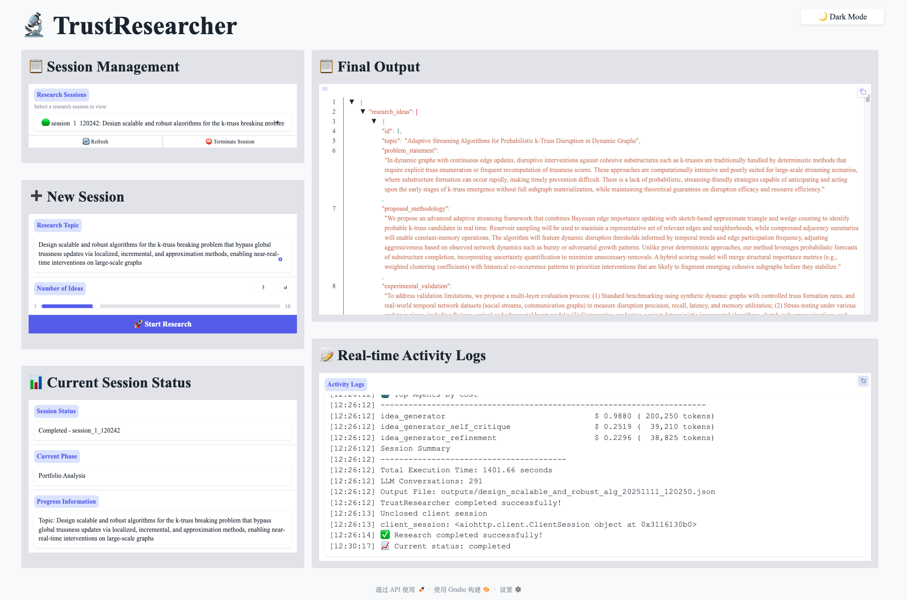

<div align="center">

# 🔬 TrustResearcher: Automating Knowledge-Grounded and Transparent Research Ideation with Multi-Agent Collaboration

Elegant, Multi-Agent Research Ideation Prototype — from literature search to refined, distinct, well‑reviewed ideas — with clear logs, reproducible artifacts, and minimal setups.

<br/>


<a href="https://arxiv.org/abs/2510.20844" target="_blank">
  
</a>
</div>

---
## 📰 News

- **[2026.02.09]** 🎉 Major architecture overhaul with clearer orchestration, improved agent delegation, and modular skill system. Continuous improvements planned with emerging models and methods.
- **[2026.01.12]** 🏆 Accepted as WWW 2026 Demo Track paper! See you in Dubai.
- **[2025.11.11]** 📝 Revised paper submission with comprehensive appendix showcasing preliminary results.
- **[2025.10.20]** 📄 Initial paper submission now available on [arXiv:2510.20844](https://arxiv.org/abs/2510.20844).


---

## ✨ Key Features & Pipeline

TrustResearcher integrates a fully literature-aware, multi-agent workflow that bridges retrieval, reasoning, and review — ensuring both novelty and evidence grounding.



The research pipeline consists of 5 main phases:

1. **Literature Retrieval** → Semantic Scholar API search to gather relevant papers based on the research topic.
2. **Idea Generation** → Planning module + literature-informed idea generation with overgeneration for robust filtering.
3. **Preliminary Selection** → Two-stage filtering: (a) External selection against literature for novelty, (b) Internal deduplication and diversity selection.
4. **Detailed Review** → Two-stage expert review system that evaluates ideas across multiple criteria (novelty, feasibility, impact, clarity).
5. **Final Selection** → Score-based ranking and selection of top ideas (≥3.5 threshold) for final output.

---

## ⚙️ Installation

Requirements
- Python 3.8+
- Network access for the model API and Semantic Scholar
- [Optional] Dedicated GPU server for real-time deduplication and KG relationship augmentation (may use preset embedding model)

*Tip: use a virtual environment (venv or conda) to isolate dependencies.*

Install
```bash
pip install -e .
```

**Configure Credentials**

Set up your API credentials in the following config files:
- `configs/llm.yaml` - LLM provider API key (OpenAI, Anthropic, etc.)
- `configs/literature_search.yaml` - Semantic Scholar API key

Other config files (`idea_generation.yaml`, `reviewer.yaml`, etc.) contain pipeline parameters and don't require credentials.


---

## 🚀 Quick Start

* CLI

```bash
# help
python -m src --help

# full pipeline (ensure configs/agent_config.yaml is set)
python -m src --topic "Design scalable and robust algorithms for the k-truss breaking problem that bypass global trussness updates via localized, incremental, and approximation methods, enabling near-real-time interventions on large-scale graphs." --num_ideas 2 --debug

python -m src --topic "Design scalable multi-agent systems for automated scientific ideation that replace linear generation with knowledge-graph-driven planning and RL-driven exploration, enabling grounded, explainable, and self-evaluated hypothesis generation via structured reasoning and adversarial peer-review loops, with publishable paper and great insights to the general AI field." --num_ideas 2 --debug

```

* Web UI

```bash
# process visualization UI
python -m src.ui_launcher --process-ui

# set UI host (default: localhost; use 0.0.0.0 for LAN)
python -m src.ui_launcher --process-ui --process-host 0.0.0.0

# set UI port (default: 7860)
python -m src.ui_launcher --process-ui --process-port 7861
```

---

## 📤 Outputs & 📜 Logs

- Results: `outputs/{topic}_{timestamp}.json` with the complete pipeline output.
- Run logs: `logs/session_YYYYMMDD_HHMMSS.log` (single file per run).
- LLM logs: `llm_logs/{topic}_{timestamp}.jsonl` (All interaction from agents per run with token & cost stats).
- Idea logs: `idea_logs/ideas_{timestamp}.json` (all generated ideas for each refinement stage).

---


## 🖼️ Case Study: Web UI in Action

Here’s what the interactive Web UI looks like when running a research session:




---


## 🧯 Troubleshooting

- Always run as a module: `python -m src ...` (avoid `python src/main.py`).
- Ensure write permissions for `outputs/`, `logs/`.

---


## 📚 Citation

If you find this work useful, please cite our paper:

```bibtex
@misc{zhou2025autoresearcher,
      title        = {{TrustResearcher}: Automating Knowledge-Grounded and Transparent Research Ideation with Multi-Agent Collaboration},
      author       = {Jiawei Zhou and Ruicheng Zhu and Mengshi Chen and Jianwei Wang and Kai Wang},
      year         = {2025},
      eprint       = {2510.20844},
      archivePrefix= {arXiv},
      primaryClass = {cs.MA},
      url          = {https://arxiv.org/abs/2510.20844}
}
```