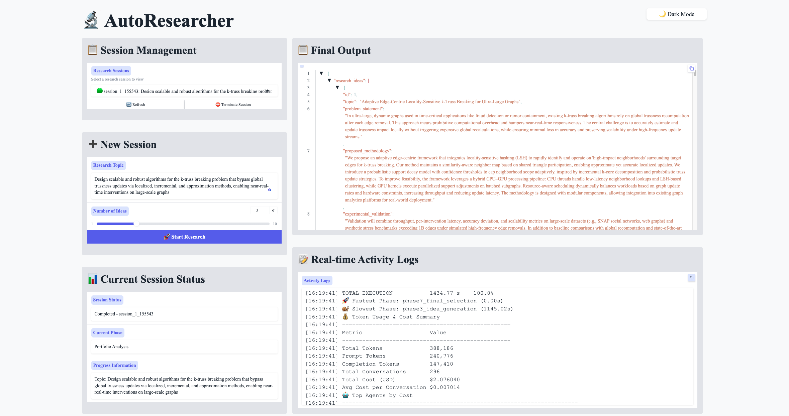

<div align="center">

# 🔬 AutoResearcher: Automating Knowledge-Grounded and Transparent Research Ideation with Multi-Agent Collaboration

Elegant, multi-stage research ideation — from literature search to refined, distinct, well‑reviewed ideas — with clear logs, reproducible outputs, and a minimal setup.

<br/>


<a href="https://arxiv.org/abs/2510.20844" target="_blank">
  
</a>
</div>


---

## 🧩 What It Does

The Autonomous Research Agent takes a topic and produces a polished set of research ideas by orchestrating a practical, literature‑aware pipeline:

- Retrieves relevant papers via the Semantic Scholar API with concurrency, rate‑limiting, retries, de‑duplication, and relevance/citation ranking.
- Builds a topic‑anchored knowledge graph to maintain external memory during ideation.
- Over‑generates ideas through planning, faceted decomposition, exploration, and self‑critique, then removes duplicates.
- Quickly evaluates candidates with weighted criteria and configurable distinctness thresholds.
- Checks distinctness against retrieved papers to avoid overlap.
- Runs reviewer, novelty, and proofreading agents in parallel and aggregates results into clean outputs.

The result is a structured JSON artifact (plus a human‑readable summary) and comprehensive logs of the process.

---

## ⚙️ Installation

Requirements
- Python 3.8+
- Network access for the model API and Semantic Scholar

*Tip: use a virtual environment (venv or conda) to isolate dependencies.*

Install
```bash
pip install -e .
```

Configure your credentials in `configs/custom_pipeline_example.yaml` and rename to `agent_config.yaml`:

---

## ✨ Key Features & Pipeline

AutoResearcher integrates a fully literature-aware, multi-agent workflow that bridges retrieval, reasoning, and review — ensuring both novelty and evidence grounding.

### 🔑 Key Features

- **Literature-Guided Pipeline** – high-signal retrieval before ideation, with concurrency, sensible defaults, and adaptive backoffs.  
- **Knowledge Graph Memory** – lightweight `networkx` graph built from the topic (optionally from uploaded documents) to anchor downstream reasoning.  
- **Robust Generation** – planning + faceted decomposition + Graph-of-Thought (GoT) exploration + self-critique with automatic de-duplication.  
- **Fast Screening** – weighted, configurable selection with distinctness thresholds.  
- **Parallel Deep Review** – reviewer, novelty, and proofreading agents run in parallel and produce consolidated evaluations.  
- **Web UI** – interactive visualization of the end-to-end process with multi-session control and live logs.  
- **Reproducible Outputs** – structured JSON results with timing and cost tracking, plus logs for multi-round refinement and LLM conversation replay.

---

### 🧭 Pipeline Overview

1. **Structured Knowledge Curation** → LLM-guided topic decomposition, Semantic Scholar retrieval, and incremental KG construction.  (Implementation: Literature Search + Knowledge Graph Construction)
2. **Diversified Idea Generation** → Planning + Graph-of-Thought reasoning + multi-strategy idea variants + iterative self-refinement.  (Implementation: Idea Generation)
3. **Multi-Stage Idea Selection** → Weighted internal scoring and external embedding-based filtering.  (Implementation: Internal + External Selection)
4. **Expert Panel Review & Synthesis** → Reviewer and novelty agents score and synthesize final ideas into a ranked portfolio. (Implementation: Detailed Review + Final Selection + Portfolio Analysis)

---


## 🖼️ Case Study: Web UI in Action

Here’s what the interactive Web UI looks like when running a research session:



---

## 🚀 Quick Start

* CLI

```bash
# help
python -m src --help

# full pipeline (ensure configs/agent_config.yaml is set)
python -m src --topic "Design scalable and robust algorithms for the k-truss breaking problem that bypass global trussness updates via localized, incremental, and approximation methods, enabling near-real-time interventions on large-scale graphs." --num_ideas 2 --debug
```


* Web UI

```bash
# process visualization UI
python -m src.ui_launcher --process-ui

# set UI host (default: localhost; use 0.0.0.0 for LAN)
python -m src.ui_launcher --process-ui --process-host 0.0.0.0

# set UI port (default: 7860)
python -m src.ui_launcher --process-ui --process-port 7861
```

---

## 📤 Outputs & 📜 Logs

- Results: `outputs/{topic}_{timestamp}.json` with the complete pipeline output.
- Run logs: `logs/session_YYYYMMDD_HHMMSS.log` (single file per run).
- LLM logs: `llm_logs/{topic}_{timestamp}.jsonl` (All interaction from agents per run with token & cost stats).
- Idea logs: `idea_logs/ideas_{timestamp}.json` (all generated ideas for each refinement stage).

---

## 🧯 Troubleshooting

- Always run as a module: `python -m src ...` (avoid `python src/main.py`).
- Ensure write permissions for `outputs/`, `logs/`, and `llm_logs/`.


## 📚 Citation

If you find this work useful, please cite our paper:

```bibtex
@misc{zhou2025autoresearcher,
      title        = {{\textsc{AutoResearcher}}: Automating Knowledge-Grounded and Transparent Research Ideation with Multi-Agent Collaboration},
      author       = {Jiawei Zhou and Ruicheng Zhu and Mengshi Chen and Jianwei Wang and Kai Wang},
      year         = {2025},
      eprint       = {2510.20844},
      archivePrefix= {arXiv},
      primaryClass = {cs.MA},
      url          = {https://arxiv.org/abs/2510.20844}
}
```